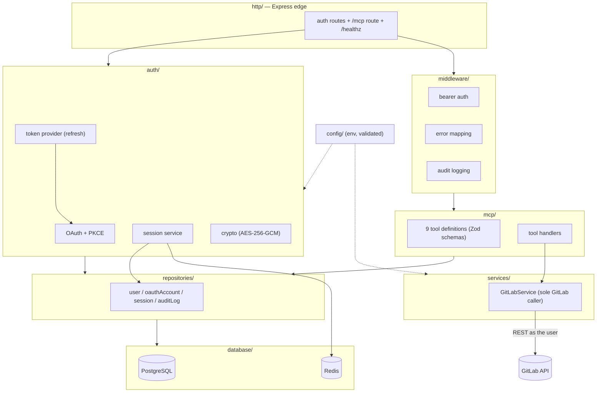
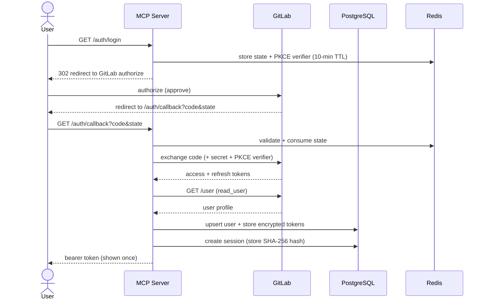
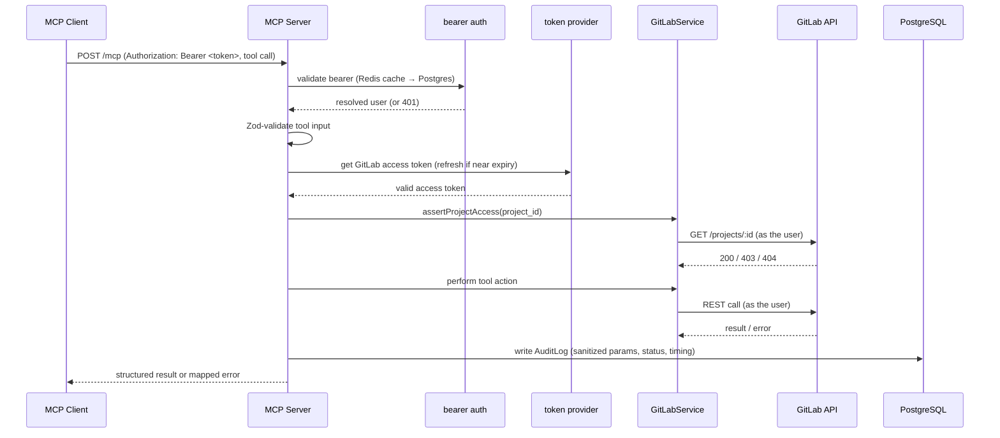

# Architecture

The GitLab MCP server is a multi-user bridge that lets AI agents (MCP clients)
perform a fixed set of GitLab operations, each executed as the authenticated
GitLab user.

## Hard rules

These invariants hold throughout the codebase:

1. **Only `GitLabService` talks to GitLab.** All outbound GitLab REST calls go
   through one service layer (`src/services/gitlabService.ts`).
2. **Only 9 MCP tools exist.** No raw API proxy, no arbitrary calls.
3. **Actions run as the user.** Every call uses the user's own OAuth token; the
   server holds no privileged service token.
4. **Tokens are encrypted at rest** (AES-256-GCM) and never logged.
5. **Everything is audited** with secrets stripped from the recorded parameters.

## Layered architecture

### Layer responsibilities

| Layer | Responsibility |
|-------|----------------|
| `config/` | Loads and validates environment configuration. |
| `database/` | PostgreSQL (Prisma) and Redis client setup. |
| `auth/` | OAuth flow with PKCE, session issuance/validation, AES-256-GCM crypto, and GitLab token refresh. |
| `services/` | `GitLabService` — the **only** component that calls the GitLab REST API. |
| `repositories/` | Persistence for users, OAuth accounts, sessions, and audit logs. |
| `mcp/` | The 9 tool definitions (Zod-validated) and their handlers. |
| `middleware/` | Bearer-token authentication, error mapping, and audit logging. |
| `http/` | Express app wiring: `/auth` routes, the `/mcp` endpoint, and `/healthz`. It also mounts the SDK `mcpAuthRouter`, which serves the server's own OAuth Authorization Server endpoints — `/authorize`, `/token`, `/register`, `/revoke`, and the `/.well-known/*` discovery documents — for MCP clients that authenticate via OAuth. |

## OAuth login flow

## MCP tool-call lifecycle

End to end: the bearer token is validated and mapped to a user; tool input is
schema-validated; the user's GitLab token is fetched (and refreshed if needed);
project access is confirmed; the action runs through `GitLabService` as that
user; and the outcome is recorded in the audit log before the response is
returned. Errors are mapped to safe, meaningful messages along the way.

## Data model

| Model | Purpose |
|-------|---------|
| **User** | A GitLab user known to the server (GitLab id, username, name, email). |
| **OAuthAccount** | The user's GitLab OAuth tokens — access and refresh tokens stored **encrypted** with expiry metadata. |
| **Session** | An issued MCP bearer token, stored as a **SHA-256 hash** with a TTL and revocation state. |
| **AuditLog** | One record per tool invocation: user, GitLab username, tool name, sanitized parameters, result status, error, and execution time. |
